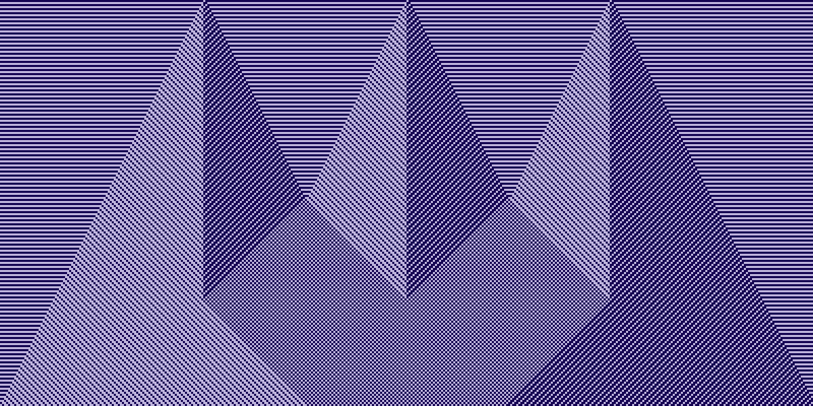
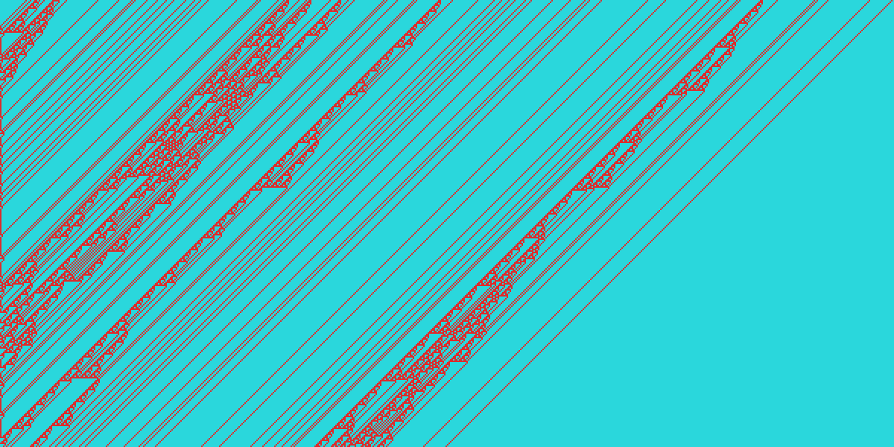
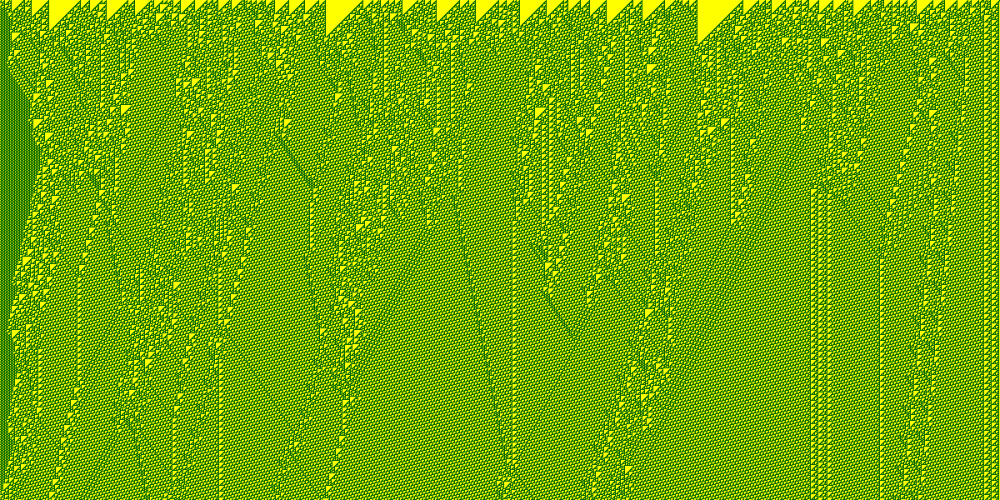

# wolfram-image

This is a simple library to create images of the Wolfram Automata.  The library package exports one definition: `make-image`.  `make-image` accepts the below keyword arguments and returns an `imago:rgb-image`.
  - `:rule` - The Wolfram rule (0-255) number used to generate the image.  Defaults to 30.
  - `:initial-gen` - A sequence for the first generation.  Defaults to one center cell alive in the first generation.
  - `:cells-wide` - The width of the image in cells.  Defaults to 400.
  - `:cells-high` - The height of the image in cells.  Defaults to 200.
  - `:cell-width` - The width of each cell in pixels.  Defaults to 3.
  - `:cell-height` - The height of each cell in pixels.  Defaults to 3.
  - `:foreground-color` - An imago color for the live cells.  Defaults to `imago:+white+`.
  - `:background-color` - An imago color for the non-live cells.  Defaults to `imago:+blue+`.

The project includes a number of tests for `make-image` in the `wolfram-image-test` package.  These may be run with the included [script](run-tests.sh).

## Examples

The below examples were made in a REPL session like this example:

```
* (defvar three-points (make-array 400 :initial-element nil))
THREE-POINTS

* (progn
    (setf (svref three-points 100) t)
    (setf (svref three-points 200) t)
    (setf (svref three-points 300) t))
T

* (defvar image-1 (wolfram-image:make-image :rule 99
                                            :initial-gen three-points
                                            :background-color (imago:make-color 20 3 82)
                                            :foreground-color (imago:make-color 190 180 220)))
IMAGE-1

* (imago:write-png image-1 "./image-1.png")
NIL
```

Rule 99



Rule 30


Rule 106



Rule 110


